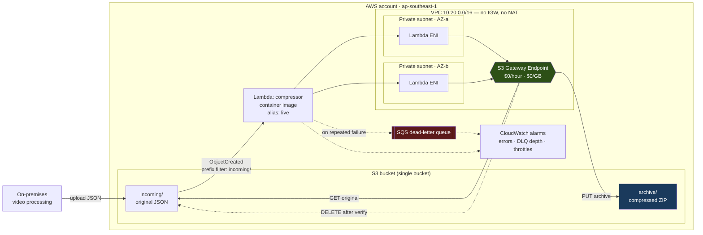

# s3-zip-archiver

Compresses objects added to an S3 bucket into ZIP archives, writes them back to the same
bucket, and deletes the originals once the archive is verified.

Built with AWS SAM. The Lambda runs as a container image in private subnets of a purpose-built
VPC and reaches S3 through an S3 Gateway VPC Endpoint. Deployed to `ap-southeast-1`.

Every number below was measured on the running stack.

| | |
|---|---|
| Compression | 83.19% (10,753,870 → 1,808,200 bytes) |
| Latency | 3–5 s, upload to archive available |
| Warm execution | 758 ms at 1024 MB, 99 MB peak |
| Cost impact at the brief's volume | saves ~$126,000/month |

## Where each task is addressed

| Task | Requirement | Where |
|---|---|---|
| 1 | SAM Lambda on new objects: zip, re-upload, delete original | [`src/app.py`](src/app.py), [`template.yaml`](template.yaml) |
| 2 | S3 + Lambda in one stack, custom VPC, private subnets, Docker, version per deploy | [`template.yaml`](template.yaml), [`src/Dockerfile`](src/Dockerfile), [Versioning](#versioning-and-rollback) |
| 3 | Commit history, public repo, documentation | This file and the commit log |
| 4 | Cost analysis and savings | [Cost analysis](#cost-analysis) |
| 5 | Scalability and bottlenecks | [Scalability](#scalability) |

## Architecture



An object lands under `incoming/`. S3 emits a notification for that prefix only, invoking the
`live` alias. The function streams the object out of S3, deflates it, writes
`archive/<name>.zip`, confirms the archive exists and is non-empty with a separate `HEAD`, then
deletes the original. Archives land under `archive/`, which the filter does not match, so the
pipeline cannot trigger itself.

## Quick start

Needs the AWS CLI, SAM CLI, Docker and `uv`.

```bash
python3 run.py install      # dev virtualenv and tooling
python3 run.py check        # lint, tests, template validation - no AWS needed

python3 run.py bootstrap    # one-time: ECR repository, CI roles
python3 run.py deploy       # build, push, deploy, publish a version
python3 run.py smoke        # end-to-end test against the live stack
```

Override defaults with `STACK=my-stack REGION=eu-west-1 PROFILE=my-profile python3 run.py deploy`.
`python3 run.py help` lists everything. The script is standard library only, so it needs no
setup of its own.

## How it works

### Preventing recursion

The function writes into the bucket it reads from. An unfiltered `ObjectCreated` notification
would mean every archive triggered another invocation, producing archives of archives without
limit.

Prevented structurally, not defensively:

- The notification is filtered to the `incoming/` prefix.
- Archives are written to `archive/`.
- S3 never emits the recursive event, so no invocation is billed for it.

The handler also rejects keys outside the source prefix. That path should be unreachable; it
exists so widening the filter later cannot arm the loop. There is a test for it.

### Not losing data

The brief requires deleting the original after compression. At that moment the archive is the
only copy, so "successfully compressed and uploaded" has to mean more than "the PUT returned".

- The archive is verified with an independent `head_object` and must exist with non-zero size
  before the original is deleted.
- On failure the handler raises. The original is untouched, the event retries, then dead-letters.
- Bucket versioning is enabled, so even a delete issued in error leaves a recoverable version.

### S3 delivery semantics

S3 notifications are at-least-once. A duplicate delivery for an object already archived and
deleted is normal. The handler treats a missing source object as success; doing otherwise would
dead-letter work that completed.

Keys arrive URL-encoded, so `my result.json` is delivered as `my+result.json` and is unquoted
before use. Both behaviours are tested.

### Not compressing what cannot compress

Already entropy-coded data (JPEG, PNG, video, existing archives) has no redundancy for DEFLATE
to find. Compressing it burns CPU and produces output larger than the input. Since the original
is then deleted, this costs money and increases stored bytes.

The handler trial-compresses the first 256 KB and stores the entry uncompressed when the sample
gains under 5%. A sample suffices because entropy is a property of the data, not of where you
look. The sample is written into the archive with the rest, so nothing is read twice.

| Input | Before | After | Method |
|---|---:|---:|---|
| Random bytes (200 KB) | +0.08% | +0.05% | stored |
| Already gzipped | +0.08% | +0.05% | stored |
| Repetitive JSON | −99.74% | −99.74% | deflated |

The result is still a valid ZIP, so the "everything under `archive/` is a `.zip`" contract holds.
The choice is logged as `method`, so a rise in stored entries shows the incoming data changed
character before the storage bill does.

This does not fix small objects. ZIP framing costs about 100 bytes, so an 11-byte file becomes a
111-byte archive. Skipping such objects would leave them in `incoming/` indefinitely and break
the invariant that the prefix is transient. At a 10 MB average that is the right trade; for a
workload of tiny files it would not be.

### Streaming

Objects stream from S3 through `zipfile` into a spooled buffer that stays in memory to 32 MB and
spills to `/tmp` beyond. Memory use is bounded by chunk size, not object size. Measured peak for
a 10 MB payload is 99 MB.

## Design decisions

### No NAT Gateway

A Lambda in a private subnet has no route to S3's public endpoint. The usual fix is a NAT
Gateway. At the brief's volume that costs $503,206/month in data processing, for traffic that
never leaves AWS.

An S3 Gateway Endpoint is a route table entry: no hourly charge, no data charge, traffic stays on
the AWS backbone. It is scoped by policy to this bucket only.

| Option | Cost/month |
|---|---:|
| S3 Gateway Endpoint | $0 |
| NAT Gateway (data + hourly) | $503,206 |

This decision is worth more than the storage saving the feature exists to deliver.

### One stack, plus a bootstrap stack

`template.yaml` holds the VPC, subnets, endpoint, bucket, Lambda, DLQ and alarms. S3 and Lambda
in one stack, as the brief requires.

`bootstrap.yaml` holds the ECR repository and the CI roles. A container-image Lambda needs its
image in ECR before CloudFormation can create the function, so the registry cannot live in the
stack that consumes it. ECR and CI credentials also outlive individual app deploys.

### Container image with no dependencies

The handler uses the Python standard library plus `boto3`, both already in the AWS base image.
No `requirements.txt`, no pip layer, no third-party supply-chain surface.

### Security

- No long-lived AWS credentials. CI uses GitHub OIDC federation; local development uses IAM
  Identity Center.
- Two CI roles. The deploy role can apply changes; the plan and drift role can create and read
  change sets but has no `ExecuteChangeSet`, `UpdateStack` or `CreateStack`.
- Both roles are scoped to one branch of one repository, and to named stacks rather than `*` —
  the account also hosts unrelated production workloads.
- The function's IAM policy is prefix-scoped: read and delete under `incoming/`, write under
  `archive/`, and no delete on archives.
- Bucket public access blocked, SSE-S3 with bucket keys, TLS-only egress.
- The bucket has `DeletionPolicy: Retain`, so deleting the stack cannot destroy data.

## Verified deployment

```
$ python3 run.py smoke
Stack:  s3-zip-archiver (ap-southeast-1)
Bucket: s3-zip-archiver-190930221916

==> Generating a 10 MB representative payload
    10,753,870 bytes (10.26 MB), 17,500 frames
==> Uploading to s3://s3-zip-archiver-190930221916/incoming/smoke-1785438565.json
==> Waiting for the archive to appear (timeout 90s)
    archive appeared after ~4s
==> Verifying the original was deleted
    original removed
==> Verifying the archive round-trips to the original bytes
    contents identical

==================== RESULT ====================
original             10753870 bytes
compressed            1808200 bytes
reduction               83.19 %
latency                     4 s
================================================
PASS
```

The corresponding log line. `record_count: 1` confirms the archive did not trigger a second
invocation:

```json
{"event": "invoked", "record_count": 1}
{"event": "archived", "source_key": "incoming/sample.json",
 "archive_key": "archive/sample.json.zip", "original_bytes": 10753870,
 "compressed_bytes": 1808200, "compression_ratio": 0.8319, "method": "deflated"}
REPORT Duration: 757.75 ms  Billed Duration: 1779 ms  Memory Size: 1024 MB
       Max Memory Used: 99 MB  Init Duration: 1021.17 ms
```

The smoke test extracts the archive and byte-compares it against what was uploaded. The original
is already deleted by then, so an archive that exists but does not extract would be worse than
none.

## Versioning and rollback

Every deploy publishes an immutable Lambda version and a `lambda-v<N>` GitHub release tagging the
commit that produced it. The Releases page is the rollback menu: choosing a version means
choosing a diff you can read.

The S3 notification invokes the `live` alias, not `$LATEST`, so moving the alias moves production
traffic.

Two mechanics carry this, and both are easy to get wrong:

**Image tags must be immutable.** SAM publishes a version only when the `ImageUri` string
changes. Deploying `:latest` produces an identical URI, CloudFormation detects no change, and no
version is published — a template that appears to implement versioning while doing nothing.
Images are tagged with the commit SHA and ECR is set to `IMMUTABLE`. `python3 run.py deploy` refuses a
dirty worktree for the same reason.

**Config changes must publish versions too.** `AutoPublishAlias` keys the version on `ImageUri`
alone, so changing a parameter updates `$LATEST` and publishes nothing while the alias keeps
serving the old version. Observed here: `CompressionLevel` changed 6 → 9, deploy reported success,
`$LATEST` read 9, the version behind the alias still read 6. Fixed with
`AutoPublishAliasAllProperties: true`.

### Rolling back

Run the **Rollback** workflow from the Actions tab with a version and a reason, or locally:

```bash
python3 run.py versions              # what exists, and what live serves
python3 run.py rollback 8
```

| | `redeploy` (default) | `alias` |
|---|---|---|
| Method | Redeploys that version's image via CloudFormation | Moves the alias directly |
| Time | ~2 min | ~2 s |
| Result | New version carrying the old image | Alias points at the old version |
| Drift | None | Yes |

`redeploy` is usually right: each version pins an immutable commit-tagged image, so redeploying
reproduces the old code exactly while CloudFormation stays the source of truth. `alias` is for
when production is actively broken.

Both roll back code. Configuration comes from `deploy.params` at HEAD, so reverting the commit is
what rolls back config.

Verified: alias moved to version 1, smoke test re-run against it and passed (83.10%, 4 s), alias
moved forward again. The workflow refuses a version that does not exist, one the alias already
serves, and a redeploy that would produce an empty change set.

## Configuration

Configuration lives in [`deploy.params`](deploy.params), read by both `python3 run.py deploy` and CI.
Changing it is an ordinary commit:

```bash
vim deploy.params
git commit -am "config: write archives to Glacier Instant Retrieval"
git push                   # CI deploys and publishes a version
python3 run.py config                # declared vs deployed
```

The full parameter set is passed on every deploy. SAM keeps the stack's previous value for
anything omitted, so a one-off `--parameter-overrides ArchiveStorageClass=GLACIER_IR` sticks
permanently while the template still reads `Default: STANDARD`, with nothing in git recording it.

Putting the parameters in `samconfig.toml` does not solve this: a command-line
`--parameter-overrides` replaces that file's list rather than merging, and `ImageUri` must be
passed every deploy, so those values are always discarded.

## Operations

### Alarms

Failures do not lose data. The original is deleted only after the archive is verified, so a
failed object stays in `incoming/` unprocessed.

| Alarm | Means | Action |
|---|---|---|
| `compressor-errors` | Compression failing | `python3 run.py logs`; objects accumulating in `incoming/` |
| `dlq-not-empty` | Events exhausted retries | `python3 run.py dlq`, inspect, fix, re-upload |
| `compressor-throttles` | Concurrency limit reached | Raise the Lambda quota |

```bash
python3 run.py logs      # tail function logs
python3 run.py dlq       # count permanently failed events
python3 run.py outputs   # bucket, alias ARN, queue URL, VPC ids
```

Logs are structured JSON, so Logs Insights can aggregate directly:

```
fields @timestamp, source_key, original_bytes, compressed_bytes, compression_ratio, method
| filter event = "archived"
| stats avg(compression_ratio), sum(original_bytes - compressed_bytes) by bin(1h)
```

### Drift

There is no state file. SAM is a transform over CloudFormation, so the state is the stack, held
by AWS. No `terraform.tfstate`, no S3 backend, no lock table. CloudFormation also stores the
deployed template, retrievable with `get-template`.

```bash
python3 run.py drift
```

A scheduled workflow runs this daily and opens a GitHub issue when the stack stops matching the
repository.

**CloudFormation does not correct drift.** It compares the new template against the previous
template, never against reality — there is no `terraform refresh`. Tested on this stack:

```
$ python3 run.py drift
CompressorLogGroup   AWS::Logs::LogGroup   /RetentionInDays   14   30

$ python3 run.py deploy               # identical template and parameters
No changes to deploy. Stack s3-zip-archiver is up to date

$ aws logs describe-log-groups ... --query 'logGroups[0].retentionInDays'
30                          # still drifted
```

Correcting it means giving CloudFormation a real diff: change the value to something else,
deploy, then change it back. Two deploys to restore one setting.

A deleted resource is worse, because it fails later rather than now. Deleting the throttle alarm
by hand produced:

1. `python3 run.py drift` reported `ThrottleAlarm  AWS::CloudWatch::Alarm  DELETED`.
2. Redeploying said `No changes to deploy`. The alarm was not recreated. Monitoring was gone and
   CI stayed green.
3. A later unrelated deploy touching that alarm failed: `not found and cannot be updated`.
4. The rollback also failed, leaving the stack in `UPDATE_ROLLBACK_FAILED` where no deploy is
   possible.

Recovery took three manual steps:

```bash
aws cloudformation continue-update-rollback --stack-name s3-zip-archiver \
  --resources-to-skip ThrottleAlarm
aws cloudwatch put-metric-alarm --alarm-name s3-zip-archiver-compressor-throttles ...
python3 run.py deploy
```

**Renaming the bucket** is not possible: S3 has no rename API. The equivalent hazard is in the
template, where `BucketName` is a replacement property. Editing it creates a new empty bucket and
detaches the old one. `DeletionPolicy: Retain` means the original survives with its data, but
unmanaged, while the pipeline writes into an empty bucket.

Detection is the last line of defence. The first is preventing console mutation with SCPs and
stack policies.

### Teardown

```bash
python3 run.py destroy
```

The bucket is retained deliberately. Removing it is an explicit, irreversible action, and
`python3 run.py destroy` prints the command rather than running it.

## Cost analysis

Figures are `ap-southeast-1` on-demand prices applied to the compression ratio and execution
duration measured on the running stack. The model is
[`scripts/cost_model.py`](scripts/cost_model.py) — run it rather than trusting the tables.

### Prices used

Pulled from the [AWS Price List API](https://docs.aws.amazon.com/awsaccountbilling/latest/aboutv2/price-changes.html)
in July 2026. `usagetype` codes are given because they are stable, while descriptions get
reworded.

| Component | `usagetype` | Price | Source |
|---|---|---:|---|
| S3 Standard, first 50 TB | `APS1-TimedStorage-ByteHrs` | $0.025/GB-mo | [S3 pricing](https://aws.amazon.com/s3/pricing/) |
| S3 Standard, next 450 TB | `APS1-TimedStorage-ByteHrs` | $0.024/GB-mo | [S3 pricing](https://aws.amazon.com/s3/pricing/) |
| S3 Standard, over 500 TB | `APS1-TimedStorage-ByteHrs` | $0.023/GB-mo | [S3 pricing](https://aws.amazon.com/s3/pricing/) |
| S3 Standard-IA | `APS1-TimedStorage-SIA-ByteHrs` | $0.0138/GB-mo | [S3 pricing](https://aws.amazon.com/s3/pricing/) |
| S3 Glacier Instant Retrieval | `APS1-TimedStorage-GIR-ByteHrs` | $0.005/GB-mo | [S3 pricing](https://aws.amazon.com/s3/pricing/) |
| S3 PUT/COPY/POST/LIST | `APS1-Requests-Tier1` | $0.005/1,000 | [S3 pricing](https://aws.amazon.com/s3/pricing/) |
| S3 GET and all other | `APS1-Requests-Tier2` | $0.004/10,000 | [S3 pricing](https://aws.amazon.com/s3/pricing/) |
| S3 PUT to Glacier IR | `APS1-Requests-GIR-Tier1` | $0.02/1,000 | [S3 pricing](https://aws.amazon.com/s3/pricing/) |
| S3 DELETE | — | free | [S3 pricing](https://aws.amazon.com/s3/pricing/) |
| Lambda compute, tier 1 | `APS1-Lambda-GB-Second` | $0.0000166667/GB-s | [Lambda pricing](https://aws.amazon.com/lambda/pricing/) |
| Lambda requests | `APS1-Request` | $0.20/million | [Lambda pricing](https://aws.amazon.com/lambda/pricing/) |
| NAT Gateway, hourly | `APS1-NatGateway-Hours` | $0.059/hour | [VPC pricing](https://aws.amazon.com/vpc/pricing/) |
| NAT Gateway, data | `APS1-NatGateway-Bytes` | $0.059/GB | [VPC pricing](https://aws.amazon.com/vpc/pricing/) |
| CloudWatch Logs ingestion | `APS1-DataProcessing-Bytes` | $0.70/GB | [CloudWatch pricing](https://aws.amazon.com/cloudwatch/pricing/) |
| CloudWatch alarm | `APS1-CW:AlarmMonitorUsage` | $0.10/alarm-mo | [CloudWatch pricing](https://aws.amazon.com/cloudwatch/pricing/) |

Prices move. To re-verify against the live API:

```bash
python3 scripts/fetch_prices.py --profile sk8jx
```

That queries the Price List API for each item above and exits non-zero if anything no longer
matches the constants in `cost_model.py`. The underlying call, for reference:

```bash
aws pricing get-products --service-code AmazonS3 --region us-east-1 \
  --filters "Type=TERM_MATCH,Field=location,Value=Asia Pacific (Singapore)"
```

The Price List API only serves from `us-east-1` and `eu-central-1`, whichever region you are
pricing.

### The workload

1,000,000 files/hour at 10 MB average, over a 730-hour month:

| | |
|---|---|
| Files/month | 730,000,000 |
| Ingested | 7,300,000 GB (7.3 PB) |
| After compression at 83.19% | 1,227,452 GB |
| Storage avoided | 6,072,548 GB per month of ingest |

### What the feature costs

| Component | Cost/month | Basis |
|---|---:|---|
| Lambda compute | $9,222.35 | 730M × 0.758 s × 1 GB |
| Lambda requests | $146.00 | 730M invocations |
| S3 GET | $292.00 | 730M requests |
| S3 PUT | $3,650.00 | 730M requests |
| S3 DELETE | $0.00 | not charged |
| CloudWatch Logs | $229.95 | ~450 B/invocation |
| CloudWatch alarms | $0.30 | 3 alarms |
| **Total** | **$13,540.60** | |

### What it saves

Storage for one month's ingest, recurring every month that data is retained:

| Scenario | Cost/month |
|---|---:|
| Uncompressed | $168,450.00 |
| Compressed | $28,781.40 |
| **Saved** | **$139,668.60** |

### Net

The feature costs ~$13,500/month and saves ~$139,700/month. **Net saving ~$126,128/month**, a
10.3× return.

It compounds: the saving applies to every month's cohort for as long as it is retained, so after
a year of retention the avoided storage is roughly twelve times that figure.

### Saving more

**1. Batch multiple objects per archive.** At 730M objects/month, per-request charges dominate
everything except compute. Buffering through SQS and archiving in groups cuts invocation, PUT and
log costs proportionally:

| Approach | Invocations/month | Feature cost/month |
|---|---:|---:|
| Per-object (current) | 730,000,000 | $13,540.60 |
| Batch 10 | 73,000,000 | $9,917.25 |
| Batch 100 | 7,300,000 | $9,554.91 |

Compression barely moves, since CPU time scales with bytes rather than object count. Batching
also improves the ratio, because DEFLATE gets a larger window over similar documents.

**2. Write archives to a colder storage class.** Archives are written once and read rarely.
Glacier Instant Retrieval is $0.005/GB-month against Standard's $0.023–0.025, with millisecond
retrieval. Implemented — set `ArchiveStorageClass=GLACIER_IR`.

The naive version of this is wrong: PUTs to Glacier IR cost $0.02/1,000 against Standard's
$0.005/1,000.

| | Cost/month |
|---|---:|
| Storage saving | $22,644.14 |
| PUT premium (730M × 4× price) | −$10,950.00 |
| **Net** | **$11,694.14** |

The premium eats half the benefit. Combined with batching there are 100× fewer requests and it
stops mattering.

**3. Both together:**

| | Cost/month |
|---|---:|
| Feature cost (batch 100) | $9,664.41 |
| Storage (Glacier IR) | $6,137.26 |
| **Total** | **$15,801.67** |
| Versus uncompressed today | $168,450.00 |
| **Net saving** | **$152,648.33 (90.6%)** |

**4. Lifecycle rules for the long tail.** Anything unread after 90–180 days should transition to
Glacier Flexible or Deep Archive, at roughly $0.0036 and $0.00099/GB-month.

**5. Log retention and tracing.** Logs expire after 14 days rather than never, which is the
default. X-Ray is sampled; unsampled tracing at 730M invocations would be a line item on its own.

**6. Right-size memory.** The function is allocated 1024 MB and peaks at 99 MB. Lambda memory
buys CPU, not just RAM, and DEFLATE is CPU-bound, so lowering it would slow execution and may not
reduce GB-seconds. This needs a power-tuning sweep. It is the one number here I have not
measured, and I would not change it without data.

**7. Turning the compression dial up does not pay.** Measured on the same 10 MB payload:

| Setting | Archive | Smaller | CPU |
|---|---:|---:|---:|
| DEFLATE 1 | 2,384,234 | 77.83% | 0.05 s |
| DEFLATE 6 (current) | 1,808,162 | 83.19% | 0.15 s |
| DEFLATE 9 | 1,726,395 | 83.95% | 0.55 s |
| BZIP2 | 1,088,021 | 89.88% | 0.67 s |
| LZMA | 1,298,010 | 87.93% | 4.15 s |

Level 9 buys 0.76 percentage points for 3.5× the CPU. Lambda bills by the millisecond, so it
costs more in compute than it saves in storage. Level 6 stays.

BZIP2 gives 40% smaller archives for 4.5× the CPU. Whether that pays depends on retention, since
compute is charged once at ingest and storage every month:

| | Per month |
|---|---:|
| Storage saved by BZIP2 | ~$11,200 |
| Extra Lambda compute | ~$32,000 |

BZIP2 loses money in month one and breaks even at roughly three months of retention. At twelve
months it saves around $100,000 per monthly cohort. It also needs 4.5× the concurrency, which
matters given the account limit below. The answer depends on the retention policy, which is a
business question.

**8. The ratio is a property of the input.** The same code achieves 83% on this JSON and about 4%
on a PNG. For already-compressed data no setting helps, and the lever is the storage class.
Converting the JSON to a columnar format such as Parquet before compressing would beat any
algorithm tuning, because it removes the repeated keys rather than encoding them more cleverly.

### Assumptions

- 7.3 PB/month is roughly 10 TB/hour sustained. If that is peak rather than steady state, every
  absolute figure scales down linearly while the ratios and conclusions hold.
- The 83.19% ratio is measured against representative synthetic JSON
  ([`scripts/generate_sample.py`](scripts/generate_sample.py)). Real payloads with more entropy
  compress less. Re-measure against real data with `python3 run.py smoke`.
- Compute is priced at the measured warm duration. Cold starts add ~1,021 ms of init; at sustained
  volume most invocations are warm, but a bursty arrival pattern raises compute cost.
- Storage tiers assume this data dominates the account's S3 usage.
- Data transfer out of S3 is excluded; retrieval patterns were not specified.

## Scalability

The design meets the brief and works today. These are the limits that bind, in order.

### 1. Lambda concurrency

Little's Law: 277.8 objects/second × 0.758 s = ~211 concurrent executions at steady state, more
during bursts.

This account's total Lambda concurrency limit is 10. AWS now provisions new accounts at 10 rather
than the 1,000 that was standard for years. This caused a real deployment failure during this
build, and it means the account quota, not the code, is the first thing that fails at production
volume. It needs a Service Quotas increase to roughly 400.

`ReservedConcurrentExecutions` is a parameter and left unset for the same reason: reserving
anything on a limit of 10 is rejected. Once the quota is raised it should be set, to bound blast
radius and stop this function starving other Lambdas.

### 2. Per-object invocation

One invocation per object is what the brief specifies and the design's main structural limit. 730M
invocations/month means per-request charges dominate, and the system is sensitive to arrival
pattern rather than just volume. The fix is batching via SQS, quantified above. That trades
latency for cost, which is reasonable here since archival is not latency-sensitive.

### 3. S3 request rates

S3 supports 3,500 PUT/s and 5,500 GET/s per prefix. At 278 objects/second we use about 8% of the
PUT budget. A 10× growth exceeds it. The mitigation is prefix sharding (`incoming/00/` …
`incoming/ff/`), which also spreads load across partitions. Worth designing in early, since
migrating prefixes later means rewriting keys.

### 4. Subnet IP capacity

Two `/24` subnets give ~502 usable addresses. Lambda's Hyperplane ENIs are shared across
concurrent executions rather than allocated per invocation, so this is not an immediate
constraint, but it is sized for hundreds of concurrent executions rather than thousands.
Production should use `/22` or larger; subnet CIDRs cannot be resized in place.

### 5. Object size

The design targets the stated 10 MB average.

- `/tmp` is the default 512 MB. Objects whose compressed form exceeds that fail once the buffer
  spills. Configurable to 10 GB.
- The 120-second timeout suits 10 MB payloads. Multi-gigabyte objects need more, up to Lambda's
  15-minute ceiling.
- Beyond a few GB per object, Lambda is the wrong tool. That work belongs in Fargate or Batch.

### 6. Cold starts

Container-image Lambdas start more slowly than ZIP packages: 1,021 ms init measured here. At
sustained volume most invocations are warm. For bursty arrivals, provisioned concurrency helps at
a cost.

### 7. Not bottlenecks

- **The S3 Gateway Endpoint.** No bandwidth limit, no charge, scales with S3.
- **The dead-letter queue.** SQS handles orders of magnitude more.
- **Compression.** CPU-bound and perfectly parallel, with no shared state.
- **The recursion guard.** Enforced by S3's notification filter, not application logic, so it
  cannot be defeated under load.

## Problems hit during this build

Each cost real time to diagnose and none are visible from reading YAML.

**1. Lambda rejected the container image.**
`The image manifest, config or layer media type for the source image is not supported.` BuildKit
produces OCI manifests by default; Lambda requires Docker Image Manifest V2 Schema 2.
`--provenance=false --sbom=false` is not sufficient — it removes the attestations but leaves the
OCI media type. The working build needs `--output type=image,oci-mediatypes=false,push=true`.

**2. Reserved concurrency could not be set.**
`ReservedConcurrentExecutions ... decreases account's UnreservedConcurrentExecution below its
minimum value of [10].` The account's total Lambda concurrency is 10. Now conditional, and omitted
rather than sent as `0`, which Lambda reads as "throttle to zero".

**3. GitHub OIDC failed with a correct-looking trust policy.**
`Not authorized to perform sts:AssumeRoleWithWebIdentity`, despite role ARN, audience and apparent
subject all being right. GitHub has moved to immutable subject claims. The token this repository
presents is:

```
repo:farhan-helmy@59960562/s3-zip-archiver@1317606042:ref:refs/heads/main
```

not the `repo:OWNER/NAME:ref:refs/heads/BRANCH` that AWS documents. This happens even though the
repository reports `use_immutable_subject: false`, and the numeric IDs do not exist until the
repository does. Resolved by pinning the `repository` and `ref` claims by exact match. IAM refuses
a GitHub OIDC trust policy that constrains neither `sub` nor `job_workflow_ref`, so a `sub`
wildcard remains, but the exact `repository` match is what makes it safe.

**4. The CI role could not deploy despite having rights to its own stack.**
`sam deploy --resolve-s3` provisions its artifact bucket through a second stack,
`aws-sam-cli-managed-default`. Both stacks are now named explicitly rather than widening to `*`.

**5. An existing OIDC provider blocked the bootstrap stack.**
An account permits one provider per issuer URL and this account already had one. Provider creation
is conditional on a parameter.

**6. A configuration change deployed successfully and changed nothing.**
`AutoPublishAlias` publishes a version only when `ImageUri` changes, so altering a parameter
updated `$LATEST` while the alias kept serving the previous version. This also made the rollback
claim false for config, since no version existed to roll back to. Fixed with
`AutoPublishAliasAllProperties: true`.

**7. Parameters are sticky, so the stack drifts from the repository.**
SAM keeps the previous value for any parameter not passed. Moving them into `samconfig.toml` does
not help, because a command-line `--parameter-overrides` replaces that file's list. Resolved with
`deploy.params`, passed in full every deploy.

**8. `samconfig.toml` and `--image-repository` cannot both specify the registry.**
`Error: Only one of the following can be provided.` The config file entry was removed.

**9. Drift detection reported no drift while broken.**
The plan role could not call `DescribeStackDriftDetectionStatus`, which takes a detection ID
rather than a stack ARN and so cannot be resource-scoped. The error went to stderr, the parsed
result was empty, the comparison against `DRIFTED` was false, and the run went green. A check that
cannot fail is worse than no check. The step now runs under `set -euo pipefail` and treats
anything other than a completed detection as failure.

Drift detection also reads every resource using the caller's permissions, and calls APIs the
template gives no hint of: `cloudwatch:ListTagsForResource` for an alarm,
`lambda:GetProvisionedConcurrencyConfig` for a function that has none,
`logs:DescribeIndexPolicies` for a log group. Found by reading `DetectionStatusReason`, not by
reasoning about the template.

**10. The plan workflow swallowed its own failure.**
The step ended in `|| true`, so a permissions error produced a green run and a pull request comment
saying the plan was empty. Same class of bug as 9.

**11. A redeploy rollback could not move the alias.**
After a fast-path alias rollback, CloudFormation still recorded the newest image, so redeploying
to that version produced an empty change set and production stayed on the old version. The
verification guard caught it. The workflow now detects this case up front and directs the operator
to the alias method, which removes the drift rather than adding to it.

## Repository layout

```
├── template.yaml              # application stack: VPC, bucket, Lambda, DLQ, alarms
├── bootstrap.yaml             # one-time: ECR repository, CI roles
├── deploy.params              # deployed configuration - the source of truth
├── samconfig.toml             # SAM CLI defaults
├── run.py                     # project commands - stdlib only, no setup needed
├── src/
│   ├── app.py                 # the handler
│   ├── Dockerfile             # dependency-free image on the AWS base
│   └── .dockerignore
├── tests/
│   ├── conftest.py
│   └── test_handler.py        # 15 tests, moto-backed, no AWS account needed
├── scripts/
│   ├── generate_sample.py     # representative video-analysis JSON
│   ├── cost_model.py          # every figure in the cost analysis
│   └── fetch_prices.py        # re-verify prices against the AWS Price List API
├── ui/                        # local dev tool - not deployed
└── .github/workflows/
    ├── ci.yml                 # lint, test, validate - every PR, no credentials
    ├── plan.yml               # change set preview posted to the PR
    ├── deploy.yml             # OIDC, build, push, deploy, tag a release
    ├── rollback.yml           # roll back to a published version
    └── drift.yml              # scheduled drift detection
```

## CI/CD

**CI** runs on every pull request and needs no AWS credentials: `ruff`, `cfn-lint`, `sam validate`
and the moto-backed tests all run offline. Fork PRs are safe to validate and anyone cloning the
repository can reproduce the check with `python3 run.py check`.

**Plan** creates a change set on pull requests touching infrastructure and posts the resource-level
changes as a comment, including whether anything would be replaced. It cannot execute the change
set. Fork PRs get no credentials.

**Deploy** runs on merge to `main`, authenticating through GitHub OIDC. No long-lived AWS keys
exist in this repository or in GitHub secrets. It builds the image tagged with the commit SHA,
pushes to ECR, deploys, and publishes a `lambda-v<N>` release. Deploys are serialised, since
concurrent runs would race to repoint the alias.

**Rollback** and **Drift** are described above.

## Live pipeline viewer

`ui/` holds a Bun and React tool for watching the pipeline: upload an object and see each stage as
it is processed, with a button to download the resulting archive.

It is not part of the deployed system and changes nothing in AWS. It runs locally, uses your own
credentials, and reads the bucket and function names from the stack outputs.

```bash
cd ui && bun install && bun run dev      # http://localhost:4173
```

See [`ui/README.md`](ui/README.md).
