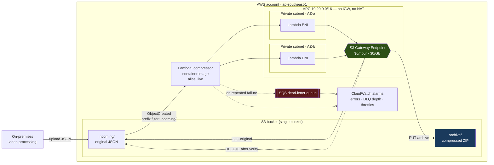

# s3-zip-archiver

Compresses objects added to an S3 bucket into ZIP archives, writes them back to the
same bucket, and deletes the originals once the archive is verified.

Built with AWS SAM. The Lambda runs as a container image in the private subnets of a
purpose-built VPC and reaches S3 through an S3 Gateway VPC Endpoint. Deployed to
`ap-southeast-1` and verified end to end — every number in this document is measured
on the running stack, not estimated.

**Measured on the deployed system:**

| | |
|---|---|
| Compression achieved | **83.19%** (10,753,870 → 1,808,200 bytes) |
| End-to-end latency | **3–5 seconds** from upload to archive available |
| Warm execution | 758 ms at 1024 MB |
| Net cost impact at the brief's volume | **saves ~$126,000/month** |

---

## Where each task is addressed

| Task | Requirement | Where |
|---|---|---|
| 1 | SAM Lambda triggered on new objects, ZIPs and re-uploads, deletes original | [`src/app.py`](src/app.py), [`template.yaml`](template.yaml) |
| 2 | S3 + Lambda in one CloudFormation stack, custom VPC, private subnets, Dockerized, versioned per deploy | [`template.yaml`](template.yaml), [`src/Dockerfile`](src/Dockerfile), [Versioning and rollback](#versioning-and-rollback) |
| 3 | Commit history, public repo, documentation | This file, and the commit log |
| 4 | Cost analysis and savings suggestions | [Cost analysis](#cost-analysis) |
| 5 | Scalability and bottlenecks | [Scalability and bottlenecks](#scalability-and-bottlenecks) |

---

## Architecture



**The flow:** an object lands under `incoming/`. S3 emits a notification *only* for that
prefix, which invokes the `live` alias of the compressor. The function streams the object
out of S3, deflates it, writes `archive/<name>.zip`, confirms the archive exists and is
non-empty with a separate `HEAD`, and only then deletes the original. Archives land under
`archive/`, which the notification filter does not match — so the pipeline cannot trigger
itself.

---

## Quick start

Requires the AWS CLI, SAM CLI, Docker, `uv` and `make`, with credentials for an account
you're happy to deploy into.

```bash
make install                       # dev virtualenv and tooling
make check                         # lint, unit tests, template validation — no AWS needed

make bootstrap                     # one-time: ECR repository + CI deploy role
make deploy                        # build image, push, deploy, publish a new version
make smoke                         # end-to-end verification against the live stack
```

Override the defaults with `make deploy STACK=my-stack REGION=eu-west-1 PROFILE=my-profile`.

Run `make help` for everything available.

---

## How it works

### Preventing infinite recursion

The function writes into the same bucket it reads from. That is the requirement, and it is
also a loaded gun: an unfiltered `ObjectCreated` notification would mean every archive the
function produced triggered another invocation, producing an archive of an archive, without
limit. The bill grows until someone notices.

This is prevented **structurally rather than defensively**:

- The S3 notification is filtered to the `incoming/` prefix.
- Archives are written to `archive/`.
- S3 therefore never emits the recursive event, so no invocation is ever billed for it.

The handler additionally rejects any key outside the source prefix. That path should be
unreachable, and it exists so that widening the filter in future cannot silently arm the
loop. There is a test for it.

### Not losing data

The brief requires deleting the original after compression. At that moment the archive is
the *only* copy, so "successfully compressed and uploaded" has to mean something stricter
than "the PUT call returned".

- The archive is verified with an independent `head_object`, and must exist with non-zero
  size, before the original is deleted.
- If verification fails, the handler raises. The original is left untouched and the event
  is retried, then dead-lettered.
- Bucket versioning is enabled as a second line of defence, so even a delete issued in
  error leaves a recoverable noncurrent version.

### Handling S3's delivery semantics

S3 notifications are **at-least-once**, so a duplicate delivery for an object that has
already been archived and deleted is normal, not exceptional. The handler treats a missing
source object as success. Doing otherwise would dead-letter work that actually completed
and page someone at 3am for nothing.

Keys also arrive URL-encoded — a file named `my result.json` is delivered as
`my+result.json` — so keys are unquoted before use. Both behaviours are tested.

---

## Design decisions

### No NAT Gateway

A Lambda in a private subnet has no route to the internet and therefore cannot reach the
public S3 endpoint. The reflexive fix is a NAT Gateway. At the volume in the brief that
decision costs **$503,206/month** in data processing charges, for traffic that never
needed to leave the AWS network at all.

An S3 Gateway Endpoint does the same job as a route table entry, at **no hourly charge and
no data charge**, and keeps the traffic on the AWS backbone. It is also scoped by policy to
this bucket alone, so a compromised function in this VPC cannot use it to reach others.

This single decision is worth more than the entire storage saving the feature was built to
deliver.

### One stack, plus a bootstrap stack

`template.yaml` contains the VPC, subnets, endpoint, bucket, Lambda, DLQ and alarms — S3
and Lambda in the same stack, as the brief requires.

`bootstrap.yaml` is separate and holds the ECR repository and the GitHub Actions deploy
role. This is not a dodge: **a container-image Lambda requires its image to exist in ECR
before CloudFormation can create the function**, so the registry cannot be created by the
stack that consumes it. ECR and CI credentials also have a different lifecycle — created
once, surviving any number of application deploys.

### Container image with no dependencies

The handler uses only the Python standard library (`zipfile`) plus `boto3`, both already
present in the AWS base image. There is no `requirements.txt` and no `pip` layer in the
Dockerfile, so the image is small, builds fast, and carries **zero third-party supply-chain
surface**.

### Streaming, not buffering

Objects are streamed from S3 through `zipfile` into a spooled buffer that stays in memory
up to 32 MB and spills to `/tmp` beyond that. Memory use is bounded by the chunk size
rather than the object size, so a 500 MB object does not need 500 MB of RAM. Measured peak
usage for a 10 MB payload is 99 MB.

### Security posture

- No long-lived AWS credentials anywhere. CI authenticates via GitHub OIDC federation;
  local development uses IAM Identity Center short-lived sessions.
- The CI role is scoped to one branch of one repository, and to named stacks rather than
  `*` — it shares an account with unrelated production workloads.
- The function's IAM policy is prefix-scoped: it can read and delete under `incoming/`,
  and write under `archive/`, but **cannot delete archives**.
- Bucket public access fully blocked, SSE-S3 encryption with bucket keys, TLS-only egress.
- The bucket carries `DeletionPolicy: Retain`, so deleting the stack cannot destroy
  customer data.

---

## Verified deployment

Not a dry run. The following is from the deployed stack in `ap-southeast-1`.

```
$ make smoke
Stack:  s3-zip-archiver (ap-southeast-1)
Bucket: s3-zip-archiver-190930221916

==> Generating a 10 MB representative payload
    10,753,870 bytes (10.26 MB), 17,500 frames
==> Uploading to s3://s3-zip-archiver-190930221916/incoming/smoke-1785438565.json
==> Waiting for the archive to appear (timeout 90s)
    archive appeared after ~4s
==> Verifying the original was deleted
    original removed
==> Verifying the archive round-trips to the original bytes
    contents identical

==================== RESULT ====================
original             10753870 bytes
compressed            1808200 bytes
reduction               83.19 %
latency                     4 s (upload to archive available)
================================================
PASS
```

The corresponding CloudWatch log line — note `record_count: 1`, confirming the archive did
not trigger a second invocation:

```json
{"event": "invoked", "record_count": 1}
{"event": "archived", "bucket": "s3-zip-archiver-190930221916",
 "source_key": "incoming/sample.json", "archive_key": "archive/sample.json.zip",
 "original_bytes": 10753870, "compressed_bytes": 1808200, "compression_ratio": 0.8319}
REPORT Duration: 757.75 ms  Billed Duration: 1779 ms  Memory Size: 1024 MB
       Max Memory Used: 99 MB  Init Duration: 1021.17 ms
```

The smoke test extracts the archive and byte-compares it against what was uploaded. By the
time it runs the original has already been deleted, so an archive that exists but does not
extract cleanly would be worse than no archive at all.

---

## Versioning and rollback

Every deploy publishes an immutable Lambda version, and the S3 notification invokes the
`live` **alias** rather than `$LATEST` — so moving the alias genuinely moves production
traffic.

Versions accumulate one per deploy, and each pins the exact image built from one commit —
so a version number always maps back to a reviewable diff. After the first four deploys:

```
$ aws lambda list-versions-by-function --function-name s3-zip-archiver-compressor
1   2   3   4

$ aws lambda get-alias --function-name s3-zip-archiver-compressor --name live
4

$ # each version pins the image built from one commit
v1: s3-zip-archiver:bcec174    v3: s3-zip-archiver:031ab62
v2: s3-zip-archiver:63cbb9c    v4: s3-zip-archiver:94c1286
```

Run `make versions` for the current state.

### The subtlety that makes this real

SAM publishes a new Lambda version **only when the `ImageUri` string changes**. Building
and pushing to `:latest` on every deploy produces a byte-identical URI, CloudFormation
detects no change, and **no version is published** — leaving a template that appears to
implement versioning while quietly doing nothing, and nothing to roll back to.

Images are therefore tagged with the commit SHA and the ECR repository is configured
`IMMUTABLE`, so a tag can never be reused. `make deploy` refuses to run against a dirty
worktree for the same reason: an image tagged with a commit must contain that commit.

### Changing configuration

Configuration lives in [`deploy.params`](deploy.params), which both `make deploy` and the
CI workflow read. Changing it is an ordinary commit:

```bash
vim deploy.params          # e.g. ArchiveStorageClass=GLACIER_IR
git commit -am "config: write archives to Glacier Instant Retrieval"
git push                   # CI deploys it and publishes a new version
make config                # declared vs actually deployed
```

Two things had to be fixed before that worked, and both were silent failures.

**A config-only change published no version, so it never reached production.**
`AutoPublishAlias` keys the version on `ImageUri` alone. Changing a parameter updated
`$LATEST` while the alias carried on serving the old version, and the deploy reported
success. Observed here: `CompressionLevel` was changed 6 → 9 and deployed cleanly;
`$LATEST` read 9 and the version behind the alias still read 6. Not one invocation used the
new setting. `AutoPublishAliasAllProperties: true` fixes it — a version is now published
whenever any property changes.

**Parameters are sticky, so the deployed config drifts from the repository.** SAM keeps the
stack's previous value for anything not passed on a deploy, so a one-off
`--parameter-overrides ArchiveStorageClass=GLACIER_IR` persists forever while the template
still reads `Default: STANDARD` and git records nothing. Putting the parameters in
`samconfig.toml` does not help either: a command-line `--parameter-overrides` replaces that
file's list rather than merging with it, and since `ImageUri` must be passed every time,
those values would always be discarded. Hence `deploy.params`, passed in full on every
deploy, so the stack always matches the file. `make config` prints both to confirm.

### Rolling back

```bash
make versions              # what exists, and what live currently serves
make rollback VERSION=1    # repoint the alias — takes effect in seconds
```

This covers configuration as well as code, now that config changes publish versions.

Verified in practice: the alias was moved to version 1, the smoke test was re-run against
it and passed (83.10% reduction, 4s latency), and the alias was then moved forward again.

Note that the CloudFormation stack still records the newer version after a manual rollback.
Redeploy from the intended commit to bring the template back into agreement.

---

## Operations

### When something breaks

Failures do not lose data — the original is only ever deleted after the archive is
verified, so a failed object stays in `incoming/` unprocessed rather than disappearing.

| Alarm | Means | Action |
|---|---|---|
| `compressor-errors` | Compression is failing | `make logs`, objects are accumulating in `incoming/` |
| `dlq-not-empty` | Events exhausted their retries | `make dlq`, inspect messages, fix, re-upload |
| `compressor-throttles` | Concurrency limit reached | Raise the Lambda concurrency quota |

```bash
make logs                  # tail function logs
make dlq                   # count permanently failed events
make outputs               # bucket name, alias ARN, queue URL, VPC ids
```

Logs are structured JSON, so CloudWatch Logs Insights can aggregate them directly:

```
fields @timestamp, source_key, original_bytes, compressed_bytes, compression_ratio
| filter event = "archived"
| stats avg(compression_ratio), sum(original_bytes - compressed_bytes) by bin(1h)
```

### Detecting drift

There is no state file to manage. SAM is a transform over CloudFormation, so the state is
the stack itself, held server-side by AWS — no `terraform.tfstate`, no S3 backend, no
DynamoDB lock table, and nothing to lose or corrupt. CloudFormation also stores the
template it deployed, retrievable with `get-template`, which makes "what is actually
deployed" answerable without trusting the working copy.

Drift detection is built in and is the direct analogue of Terraform noticing out-of-band
changes:

```bash
make drift
```

Real output, after deliberately moving the alias by hand:

```
DETECTION_COMPLETE   DRIFTED   1
CompressorFunctionAliaslive   AWS::Lambda::Alias   MODIFIED
/FunctionVersion   10   1   NOT_EQUAL
```

That is exactly what `make rollback` produces, and it is the honest cost of an emergency
alias move: fast, but it leaves the stack disagreeing with reality until the next deploy.

One useful thing the processed template shows is how much SAM generates. The 15 resources
written here expand to 19, with SAM adding the execution role, the S3 invoke permission,
the alias, and the version — the last named `CompressorFunctionVersiona5dff950f6`. That
hash is derived from the function's properties, and it is the whole reason config changes
published nothing before `AutoPublishAliasAllProperties`: the hash only covered `ImageUri`,
so a config change produced an identical logical ID and therefore no new version.

```bash
aws cloudformation get-template --stack-name s3-zip-archiver --template-stage Processed
```

### Teardown

```bash
make destroy
```

The bucket is deliberately retained — removing it is an explicit, irreversible operator
action and `make destroy` prints the exact command rather than doing it for you.

---

## Cost analysis

**All figures are `ap-southeast-1` on-demand prices pulled from the AWS Pricing API in July
2026, applied to the compression ratio and execution duration measured on the running
stack.** The model is [`scripts/cost_model.py`](scripts/cost_model.py) — run it yourself
rather than trusting the tables below.

### The workload

At 1,000,000 files/hour averaging 10 MB, over a 730-hour month:

| | |
|---|---|
| Files per month | 730,000,000 |
| Ingested | 7,300,000 GB (**7.3 PB/month**) |
| After compression at 83.19% | 1,227,452 GB (1.23 PB) |
| Storage avoided | 6,072,548 GB per month of ingest |

### What the feature costs to run

| Component | Cost/month | Basis |
|---|---:|---|
| Lambda compute | $9,222.35 | 730M × 0.758 s × 1 GB |
| Lambda requests | $146.00 | 730M invocations |
| S3 GET (read original) | $292.00 | 730M requests |
| S3 PUT (write archive) | $3,650.00 | 730M requests |
| S3 DELETE (remove original) | $0.00 | DELETE is not charged |
| CloudWatch Logs | $229.95 | ~450 B/invocation |
| CloudWatch alarms | $0.30 | 3 alarms |
| **Total** | **$13,540.60** | |

### What it saves

Storage for **one month's ingest**, recurring every month that data is retained:

| Scenario | Cost/month |
|---|---:|
| Uncompressed (today) | $168,450.00 |
| Compressed | $28,781.40 |
| **Saved** | **$139,668.60** |

### Net effect

> **The feature costs ~$13,500/month and saves ~$139,700/month.**
> **Net saving: ~$126,128/month — a 10.3× return.**

And it compounds: the saving applies to *every* month's cohort of data for as long as it is
retained, so after a year of retention the avoided storage is roughly twelve times that
figure.

### The decision that mattered more than compression

| Option | Cost/month |
|---|---:|
| S3 Gateway Endpoint (chosen) | **$0.00** |
| NAT Gateway — data processing (8,527,452 GB × $0.059) | $503,119.67 |
| NAT Gateway — hourly (2 AZs) | $86.14 |
| **NAT total** | **$503,205.81** |

Using a NAT Gateway instead of a Gateway Endpoint would have cost **more than three and a
half times the entire storage saving the project was built to achieve**, and would have
turned a $126k/month win into a $377k/month loss. It is the single highest-leverage line in
this document, and it is a routing decision, not a code one.

### Suggestions for saving more

**1. Batch multiple objects per archive.** At 730M objects/month, per-request charges
dominate everything except compute. Buffering objects through SQS and archiving them in
groups cuts invocation, PUT and log costs proportionally:

| Approach | Invocations/month | Feature cost/month |
|---|---:|---:|
| Per-object (current) | 730,000,000 | $13,540.60 |
| Batch 10 | 73,000,000 | $9,917.25 |
| Batch 100 | 7,300,000 | $9,554.91 |

Compression itself barely moves, because CPU time scales with bytes rather than object
count. Batching also tends to *improve* the ratio, since DEFLATE gets a larger window over
structurally similar documents.

**2. Write archives to a colder storage class.** Archives are written once and read rarely.
Glacier Instant Retrieval costs $0.005/GB-month against Standard's $0.023–0.025, with
millisecond retrieval. Already implemented — set `ArchiveStorageClass: GLACIER_IR`.

But the naive version of this recommendation is **wrong in an instructive way**: PUTs to
Glacier IR cost $0.02/1,000 against Standard's $0.005/1,000, four times as much.

| | Cost/month |
|---|---:|
| Storage saving | $22,644.14 |
| PUT premium (730M × 4× price) | −$10,950.00 |
| **Net** | **$11,694.14** |

The premium eats roughly half the benefit. Combine it with batching, however, and the
per-request premium becomes irrelevant because there are 100× fewer requests:

**3. Both together:**

| | Cost/month |
|---|---:|
| Feature cost (batched 100) | $9,664.41 |
| Storage (Glacier IR) | $6,137.26 |
| **Total** | **$15,801.67** |
| Versus uncompressed today | $168,450.00 |
| **Net saving** | **$152,648.33 (90.6% reduction)** |

**4. Lifecycle rules for the long tail.** Anything not read after 90–180 days should
transition to Glacier Flexible or Deep Archive, at roughly $0.0036 and $0.00099/GB-month.
For genuinely cold archives that is a further 5–10× reduction.

**5. Reconsider log retention and tracing.** Logs already expire after 14 days rather than
never, which is the default. X-Ray tracing is enabled and sampled; at 730M invocations
unsampled tracing would be a meaningful line item on its own.

**6. Right-size memory with a power-tuning sweep.** The function is allocated 1024 MB and
peaks at 99 MB — but Lambda memory buys CPU, not just RAM, and DEFLATE is CPU-bound, so
lowering it would slow execution and may not reduce GB-seconds at all. This needs measuring
across settings rather than assuming; it is the one number in this document I have not
measured, and I would not change it without data.

**7. Turning the compression dial up does not pay.** The obvious lever is the last one
worth pulling. Measured on the same 10 MB payload:

| Setting | Archive | Smaller | CPU time |
|---|---:|---:|---:|
| DEFLATE level 1 | 2,384,234 | 77.83% | 0.05 s |
| DEFLATE level 6 (current) | 1,808,162 | 83.19% | 0.15 s |
| DEFLATE level 9 | 1,726,395 | 83.95% | 0.55 s |
| BZIP2 | **1,088,021** | **89.88%** | 0.67 s |
| LZMA | 1,298,010 | 87.93% | 4.15 s |

Level 9 buys **0.76 percentage points for 3.5× the CPU** — and Lambda bills by the
millisecond, so it costs more in compute than it saves in storage. Level 6 stays.

BZIP2 is the interesting one: 40% smaller archives than DEFLATE for 4.5× the CPU. Whether
that pays depends entirely on **how long the data is kept**, because compute is charged
once at ingest while storage is charged every month:

| | Per month |
|---|---:|
| Storage saved by BZIP2 | ~$11,200 |
| Extra Lambda compute | ~$32,000 |

So BZIP2 loses money on month one and breaks even at roughly **three months of retention**.
Beyond that it wins, and at a twelve-month retention it saves around $100,000 per monthly
cohort. It also needs ~4.5× the concurrency for the same throughput, which matters given
the account limit above. The right answer is genuinely "it depends on the retention
policy", and that is a question for the business rather than the code.

**8. The ratio is a property of the input, not the algorithm.** The same code achieves
83% on this JSON and about 4% on a PNG, because a PNG is already entropy-coded and there is
no redundancy left to find. For data that is already compressed — images, video, existing
archives — no compression setting will help, and the lever is the storage class instead.
Converting the JSON to a columnar format such as Parquet before compressing would beat any
amount of algorithm tuning, because it removes the repeated keys rather than encoding them
more cleverly.

### Assumptions, and where they would break

These figures rest on the brief's stated numbers taken at face value. Worth stating plainly:

- **7.3 PB/month is an extraordinary volume** — roughly 10 TB/hour, sustained. If that
  figure is a peak rather than a steady state, every absolute number here scales down
  linearly while the *ratios* and the architectural conclusions hold unchanged.
- **The 83.19% ratio is measured against representative synthetic JSON**
  ([`scripts/generate_sample.py`](scripts/generate_sample.py)) — per-frame detections,
  scene boundaries, transcripts. Real payloads with more entropy (embedded base64, float
  arrays) would compress less. The measurement is reproducible, and re-measurable against
  real data by running `make smoke`.
- **Compute is priced at the measured warm duration.** Cold starts add ~1,021 ms of init;
  at sustained volume the overwhelming majority of invocations are warm, but a bursty
  arrival pattern would raise compute cost.
- Storage tiers assume this data dominates the account's S3 usage.
- Data transfer out of S3 is excluded — the archives are read rarely, and retrieval
  patterns weren't specified.

---

## Scalability and bottlenecks

The design meets the brief and works today. At the stated scale, these are the things that
would break, in the order they would break.

### 1. Lambda concurrency — the immediate hard limit

Little's Law: 277.8 objects/second × 0.758 s = **~211 concurrent executions** needed at
steady state, more during bursts.

**This account's total Lambda concurrency limit is 10.** AWS now provisions new accounts at
10 rather than the 1,000 that was standard for years. This isn't hypothetical — it caused a
real deployment failure during this build (see below), and it means the account quota, not
the code, is the first thing that fails at production volume. It needs a Service Quotas
increase to roughly 400 for headroom.

`ReservedConcurrentExecutions` is exposed as a parameter and left unset for the same
reason: reserving anything on a limit of 10 is rejected outright. Once the quota is raised
it should be set, to bound blast radius and to stop this function starving other Lambdas in
the account.

### 2. Per-object invocation — the architectural ceiling

One invocation per object is what the brief specifies, and it is the design's main
structural limitation. 730M invocations/month means per-request charges dominate, and the
system is sensitive to the arrival *pattern* rather than just the volume.

The fix is batching via SQS between S3 and Lambda, quantified in the cost section above.
That trades latency for cost and throughput — reasonable here, since nothing about archival
is latency-sensitive.

### 3. S3 request rates per prefix

S3 supports 3,500 PUT/s and 5,500 GET/s **per prefix**. At 278 objects/second we are
comfortably inside that, using roughly 8% of the PUT budget. A 10× growth would exceed it,
and the mitigation is prefix sharding — `incoming/00/` … `incoming/ff/` — which also
spreads load across S3 partitions. Worth designing in before it's needed, since migrating
prefixes later means rewriting keys.

### 4. Subnet IP capacity

The two `/24` subnets provide ~502 usable addresses. Lambda's Hyperplane ENIs are shared
across concurrent executions rather than allocated per invocation, so this is not an
immediate constraint, but it is sized for hundreds of concurrent executions and not
thousands. Production should use `/22` or larger — cheap to do now, disruptive later, since
subnet CIDRs cannot be resized in place.

### 5. Object size assumptions

The design targets the stated 10 MB average:

- `/tmp` is the default 512 MB. Objects whose *compressed* form exceeds that would fail
  once the spooled buffer spills. Configurable up to 10 GB.
- The 120-second timeout suits 10 MB payloads; a multi-gigabyte object would need more,
  up to Lambda's 15-minute ceiling.
- Beyond a few GB per object, Lambda is the wrong tool entirely — that work belongs in
  Fargate or Batch, with no execution time limit.

### 6. Cold starts

Container-image Lambdas start more slowly than ZIP packages — measured at 1,021 ms init
here. At sustained volume most invocations are warm and this is irrelevant. For bursty
arrivals, provisioned concurrency would help, at a cost.

### 7. What is *not* a bottleneck

Worth being explicit, since these are common assumptions:

- **The S3 Gateway Endpoint.** No bandwidth limit, no charge, scales with S3 itself.
- **The dead-letter queue.** SQS handles orders of magnitude more than this.
- **Compression.** CPU-bound and perfectly parallel; it scales horizontally with
  concurrency and has no shared state.
- **The recursion guard.** Enforced by S3's notification filter, not by application logic,
  so it cannot be defeated under load.

---

## Problems hit during this build

Everything here was encountered on the way to a working deployment, and each cost real time
to diagnose. Documented because the fixes are not obvious from the AWS documentation.

**1. Lambda rejected the container image.**
`The image manifest, config or layer media type for the source image is not supported.`
Docker's BuildKit produces OCI manifests by default; Lambda requires Docker Image Manifest
V2 Schema 2. `--provenance=false --sbom=false` alone is *not* sufficient — it removes the
attestations but leaves the OCI media type. The working build needs
`--output type=image,oci-mediatypes=false,push=true`.

**2. Reserved concurrency could not be set.**
`ReservedConcurrentExecutions ... decreases account's UnreservedConcurrentExecution below
its minimum value of [10].` The account's *total* Lambda concurrency is 10, so no
reservation is possible. Now conditional, and omitted rather than sent as `0` — which
Lambda would interpret as "throttle this function to zero".

**3. GitHub OIDC failed with a correct-looking trust policy.**
`Not authorized to perform sts:AssumeRoleWithWebIdentity`, despite the role ARN, audience
and apparent subject all being right. GitHub has moved to **immutable subject claims**. The
token this repository actually presents is:

```
repo:farhan-helmy@59960562/s3-zip-archiver@1317606042:ref:refs/heads/main
```

not the `repo:OWNER/NAME:ref:refs/heads/BRANCH` that AWS documents and every guide
reproduces — and this happens even though the repository still reports
`use_immutable_subject: false`. The numeric IDs also don't exist until the repository does,
so they can't simply be written into the template.

Resolved by pinning the `repository` and `ref` claims by exact match instead. IAM refuses a
GitHub OIDC trust policy that constrains neither `sub` nor `job_workflow_ref`, so a `sub`
wildcard remains to satisfy that rule — but it is explicitly the loose half of the
condition, and the exact `repository` match is what makes the policy safe.

**4. The CI role couldn't deploy despite having rights to its own stack.**
`sam deploy --resolve-s3` provisions its artifact bucket through a *second* stack,
`aws-sam-cli-managed-default`. Scoping `cloudformation:*` to the project's stack alone fails
before the application stack is touched. Both stacks are now named explicitly, rather than
widening to `*` in an account that also hosts production workloads.

**5. An existing OIDC provider blocked the bootstrap stack.**
An AWS account permits only one OIDC provider per issuer URL, and this account already had
one. Creating it unconditionally fails with `EntityAlreadyExists`, so provider creation is
conditional on a parameter.

**6. A configuration change deployed successfully and changed nothing.**
`AutoPublishAlias` publishes a version only when `ImageUri` changes, so altering a
parameter updated `$LATEST` while the alias kept serving the previous version.
`CompressionLevel` was set 6 → 9, CloudFormation reported success, `$LATEST` read 9 — and
the version behind the alias still read 6. The setting reached zero invocations. Worse, the
rollback story was quietly false for config: there was no version to roll back to. Fixed
with `AutoPublishAliasAllProperties: true`.

**7. Parameters are sticky, so the running stack drifts from the repository.**
SAM keeps the stack's previous value for any parameter not passed. A single
`--parameter-overrides ArchiveStorageClass=GLACIER_IR` therefore persisted across every
later deploy while the template still read `Default: STANDARD`, with nothing in git
recording it. The obvious fix of moving parameters into `samconfig.toml` does not work
either — a command-line `--parameter-overrides` replaces that file's list outright, and
`ImageUri` must be passed on every deploy, so those values are always discarded. Resolved
with `deploy.params`, passed in full every time.

**8. `samconfig.toml` and `--image-repository` cannot both specify the registry.**
`Error: Only one of the following can be provided: '--image-repositories',
'--image-repository', '--resolve-image-repos'.` The config file's entry was removed, since
the Makefile and CI derive the registry from the authenticated account rather than
hardcoding an ID.

---

## Repository layout

```
├── template.yaml              # application stack: VPC, bucket, Lambda, DLQ, alarms
├── bootstrap.yaml             # one-time: ECR repository, GitHub OIDC deploy role
├── deploy.params              # deployed configuration — the source of truth
├── samconfig.toml             # SAM CLI defaults (stack name, region, capabilities)
├── Makefile                   # build, deploy, smoke, rollback, teardown
├── src/
│   ├── app.py                 # the handler
│   ├── Dockerfile             # dependency-free image on the AWS base
│   └── .dockerignore
├── tests/
│   ├── conftest.py
│   └── test_handler.py        # 12 tests, moto-backed, no AWS account needed
├── scripts/
│   ├── smoke.sh               # end-to-end verification with round-trip integrity check
│   ├── generate_sample.py     # representative video-analysis JSON
│   └── cost_model.py          # every figure in the cost analysis
├── ui/                        # local dev tool — not deployed, see below
└── .github/workflows/
    ├── ci.yml                 # lint, test, validate — on every PR, no credentials
    └── deploy.yml             # OIDC auth, build, push, deploy — on merge to main
```

## Live pipeline viewer (development tool)

`ui/` contains a small Bun + React tool for watching the pipeline work: upload an
object and see each stage light up as it is processed.

**It is not part of the deployed system and changes nothing in AWS.** It runs
locally, uses your own credentials, reads the bucket and function names from the
stack outputs, and reports what it observes — Lambda's structured logs for the
invocation and compression, and independent S3 checks for the archive appearing
and the original being deleted.

```bash
cd ui && bun install && bun run dev      # http://localhost:4173
```

The browser connection is a real WebSocket, but the AWS side is polled roughly
once a second — neither S3 nor Lambda pushes events to a laptop, and the
alternative would mean deploying infrastructure this tool deliberately avoids
touching. See [`ui/README.md`](ui/README.md).

## CI/CD

Two workflows, both visible in the Actions tab.

**CI** runs on every pull request and needs no AWS credentials at all — `ruff`, `cfn-lint`,
`sam validate` and the moto-backed test suite all run offline. Fork PRs are therefore safe
to validate, and anyone cloning this repository can reproduce the whole check with
`make check`.

**Deploy** runs on merge to `main`, authenticating through GitHub OIDC. No long-lived AWS
keys exist in this repository or in GitHub secrets. It builds the image tagged with the
commit SHA, pushes to ECR, deploys the stack, and writes the published Lambda version to
the run summary so a future rollback doesn't begin with archaeology.

Deploys are serialised via a concurrency group — two simultaneous runs would race to
repoint the alias and could leave production on an older commit.
